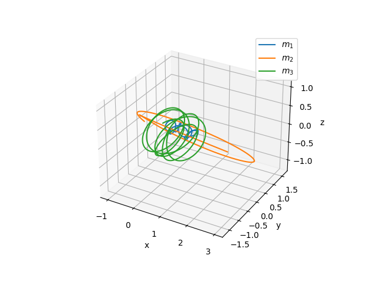

# Numerical Methods Library

This repository provides a collection of C++ templates for solving Ordinary Differential Equations (ODEs), performing numerical integration, and finding the roots of functions. 

---

## Features

### ODE Solvers
The library supports several methods for solving systems of ODEs:
- **Euler Method (Eulero)**
- **Runge-Kutta 2nd Order (RK2)**
- **Runge-Kutta 4th Order (RK4)**

These solvers are implemented as template functions, providing flexibility in data types.

### Numerical Integration
The library provides the following methods for definite integration:
- **Trapezoidal Rule**
- **Simpson's Rule**
- **Romberg Integration**
- **Gaussian Quadratures**
  - Legendre Polynomials
  - Laguerre Polynomials
  - Hermite Polynomials
- **Monte Carlo Methods**
  - Standard Monte Carlo Integration
  - Hit-or-Miss Method

### Root Finding
The library offers algorithms for finding the roots of functions:
- **Bisection Method**
- **Newton-Raphson Method**

---

# Computational physics
Below, you'll find descriptions of the key projects, including their physical context and a brief explanation of the implementation.

---

## 1. Three-Body Problem
The **three-body problem** is a classic problem in celestial mechanics, where the motion of three gravitationally interacting bodies is simulated. The system is chaotic and sensitive to initial conditions, showcasing fascinating orbits and interactions.

### Features:
- Implementation of numerical solvers (Euler, RK2, RK4) for the equations of motion.
- Energy conservation verification.
- Dynamic visualization of orbits in 3D space.

  
  

---

## 2. Double Pendulum
The **double pendulum** is a nonlinear dynamical system that exhibits chaotic behavior. Small changes in initial conditions can lead to drastically different trajectories, making it an ideal system for studying chaos theory.

### Features:
- Numerical solution of equations of motion using RK4 integration.
- Analysis of the chaotic behavior and visualization of the pendulum's trajectories.

  

---

## 3. Infinite Square Well in Quantum Mechanics
This simulation solves the **infinite square well problem** in quantum mechanics. It demonstrates the quantization of energy levels and the behavior of wavefunctions in a confined system.

### Features:
- Numerical solution of the Schrödinger equation.
- Visualization of wavefunctions and energy eigenstates.

---

## 4. Lorenz Attractor
The **Lorenz attractor** is a system of ordinary differential equations that models atmospheric convection. It is widely known as an iconic example of chaotic behavior in deterministic systems.

### Features:
- Simulation of the Lorenz system.
- Visualization of the butterfly-shaped attractor in 3D space.

---

## 5. Harmonic Oscillator and Fast Fourier Transform (FFT)
This project studies the **harmonic oscillator** using the **Fast Fourier Transform (FFT)** to analyze its frequency spectrum. This approach demonstrates the usefulness of FFT in understanding periodic motion.

### Features:
- Numerical simulation of a harmonic oscillator.
- Application of FFT to extract frequency components.
- Visualization of the oscillatory motion and its frequency spectrum.

---

## 6. Newton Fractal
The **Newton fractal** is a fascinating visualization generated from the iterative application of Newton's method to complex functions. The fractal demonstrates the convergence behavior of the method.

### Features:
- Implementation of Newton's method for root-finding in the complex plane.
- Generation of fractals based on the method's convergence.
- Color-coded visualization of convergence to different roots.

---

